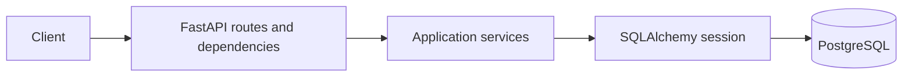
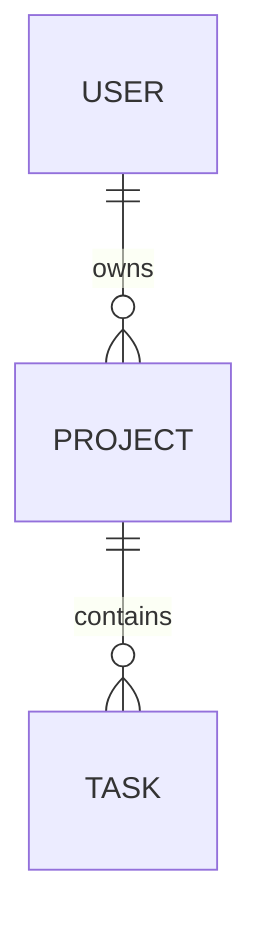

# Taskflow API

A Python backend for personal projects and tasks, built as a software engineering
portfolio project. The focus is ownership isolation, explicit transactions,
database integrity, and reproducible verification—not just CRUD endpoints.

**Stack:** Python 3.12 · FastAPI · Pydantic 2 · synchronous SQLAlchemy 2 · Psycopg 3 ·
PostgreSQL 17 · Alembic · pytest · uv · Docker Compose · GitHub Actions.

## Live API

Public Swagger documentation: [https://taskflow-api-1-11gt.onrender.com/docs](https://taskflow-api-1-11gt.onrender.com/docs)

Health checks: `/health/live` and `/health/ready`.

The Render free instance may have a cold start after inactivity, making the first
request slower.

## Features

- Registration, Argon2id password hashing, short-lived JWT login, and profile updates.
- Owner-scoped projects and tasks, pagination, task filters, and completion tracking.
- Database constraints and migrations, with integration tests against real PostgreSQL.
- Consistent errors, request IDs, structured logs, and separate liveness/readiness checks.
- Non-root API container and CI for linting, types, migrations, and tests.

## Architecture



FastAPI validates input with Pydantic and resolves the authenticated user and a
request-scoped database session. Services apply business rules, scope queries to
the owner, and commit or roll back writes. SQLAlchemy executes parameterized queries;
response schemas control what leaves the API. Middleware adds request IDs and logs,
while centralized exception handlers produce public errors.

```text
app/
├── main.py             # Application composition and lifespan
├── api/                # Shared dependencies, health, errors, request logging
├── core/               # Settings, hashing, JWTs, logging, application exceptions
├── db/                 # Declarative Base, model registry, engine/session factory
└── modules/
    ├── users/          # Registration and profile
    ├── auth/           # Token issuance and verification
    ├── projects/       # Ownership-scoped project operations
    └── tasks/          # Ownership-scoped tasks and status transitions
migrations/             # Versioned schema changes
tests/integration/     # PostgreSQL-backed API tests
.github/workflows/ci.yml # Automated checks
```

Feature modules contain routers, schemas, services, and models where applicable.
SQLAlchemy models describe persistence; Pydantic schemas describe API contracts.

## Database design



| Table | Main fields and guarantees |
| --- | --- |
| `users` | UUID ID, unique non-null email, password hash, display name |
| `projects` | UUID ID, required owner FK, name, nullable description |
| `tasks` | UUID ID, required project FK, title, description, status, priority, due/completion timestamps |

All tables have timezone-aware creation/update timestamps. Project deletion cascades
to tasks; deleting a user with projects is restricted. CHECK constraints enforce
valid task status (`todo`, `in_progress`, `done`), priority (`1`, `2`, `3`), and
completion consistency. Composite indexes support owner/project-scoped listing.

Any status can transition to another valid status. Entering `done` sets
`completed_at`; reopening clears it. Repeating `done` preserves the timestamp.

## Authentication and authorization

Registration validates and lowercases email addresses and hashes passwords with
Argon2id. Passwords must contain 15–128 characters and cannot be blank. Public user
schemas never expose password hashes.

Login accepts JSON email/password and returns an HS256-signed bearer JWT, with a
15-minute default lifetime. Verification fixes the algorithm and checks `sub`,
`iss`, `aud`, `iat`, and `exp`. The current-user dependency resolves the token subject
to an existing user; services separately enforce resource ownership.

Projects are queried with `owner_id = current_user.id`. Task queries join the parent
project and apply the same restriction. Request schemas reject ownership fields.
Missing and inaccessible resources both return **404**, preventing resource-existence
disclosure through different status codes.

## API overview

Interactive documentation: `/docs`; OpenAPI schema: `/openapi.json`.

| Method | Path | Purpose |
| --- | --- | --- |
| GET | `/health/live`, `/health/ready` | Process liveness / actual database connectivity |
| POST | `/api/v1/users` | Register; returns 201 |
| POST | `/api/v1/auth/token` | Authenticate and issue an access token |
| GET, PATCH | `/api/v1/users/me` | Read profile / update display name only |
| POST, GET | `/api/v1/projects` | Create / list owned projects |
| GET, PATCH, DELETE | `/api/v1/projects/{id}` | Read / update / delete an owned project |
| POST, GET | `/api/v1/projects/{id}/tasks` | Create / list tasks in an owned project |
| GET, PATCH, DELETE | `/api/v1/tasks/{id}` | Read / update / delete an owned task |

Lists accept `limit` and `offset`, ordered by `created_at DESC, id DESC`. Tasks also
accept `status`, `priority`, and `due_before` (strictly earlier than the supplied
timezone-aware timestamp). Deletes return 204.

Errors use one envelope; 401 covers authentication, 409 duplicate email, and 422
validation. Validation details retain field locations without echoing submitted values.

```json
{
  "error": {"code": "not_found", "message": "Resource not found", "details": []},
  "request_id": "bc23ec72-4bea-41fd-972d-0ef825ff1644"
}
```

## Local development

Prerequisites: [uv](https://docs.astral.sh/uv/getting-started/installation/) and
Docker with Compose. Run commands from the repository root.

```sh
uv python install 3.12
uv sync --locked
cp .env.example .env  # First setup only; preserve an existing .env
uv run python -c 'import secrets; print(secrets.token_hex(32))'
# Paste the generated value into APP_JWT_SECRET in .env.
docker compose up -d --wait db
uv run alembic upgrade head
uv run uvicorn app.main:app --reload
```

The API is at `http://127.0.0.1:8000`. `.env.example` lists all settings. Host development
uses `APP_DB_HOST=127.0.0.1`; choose an unused `APP_DB_PORT` such as `5433` if needed.
Shell environment variables override `.env`. Unknown `.env` keys fail validation.
Never commit `.env` or reuse its development credentials in production.

## Docker setup

After configuring `.env`:

```sh
docker compose config --quiet
docker compose build api
docker compose up -d --wait --wait-timeout 120
curl -i http://127.0.0.1:8000/health/ready
docker compose ps
docker compose logs -f api
```

Stop host Uvicorn first, or `export API_PUBLISHED_PORT=8001` and use that host port.
Keep this Compose-only override in the shell, not `.env`.

The image installs locked runtime dependencies and runs as UID 10001. An allowlisted
build context excludes `.env` and unrelated files. Compose injects runtime settings;
inside the network the API connects to **`db:5432`**, regardless of the published host
DB port. It waits for PostgreSQL health, applies migrations, then starts Uvicorn only
if migration succeeds. The image health check calls `/health/ready`.

```sh
docker compose stop          # Stop containers; retain data
docker compose down        # Remove containers/network; retain database volume
# docker compose down --volumes  # Destructive: also deletes database data
```

To return to host development, stop `api`, start only `db`, and run local Uvicorn.

## Migration workflow

After changing model metadata:

```sh
uv run alembic revision --autogenerate -m "describe schema change"
# Review upgrade() and downgrade(); autogeneration is a draft.
uv run alembic upgrade head
uv run alembic check
```

Commit models and migrations together. `upgrade()` applies a revision; `downgrade()`
reverses it where possible and may destroy data. No application startup uses
`create_all()`. With Compose running, use `docker compose exec api alembic current`
or `docker compose exec api alembic check` to inspect the container environment.

## Testing and CI

```sh
uv run ruff check .
uv run ruff format --check .
uv run mypy
uv run alembic upgrade head
uv run alembic check
uv run pytest
```

The PostgreSQL fixtures create a randomly named database, migrate it, truncate data
between tests, and drop it afterward. The configured local test role therefore needs
permission to create databases. Requests use real sessions and commits, exercising
registration races, authentication failures, cross-user isolation, task transitions,
constraints, cascading deletion, error handling, and log privacy.

[CI](.github/workflows/ci.yml) runs the same checks on pull requests and pushes to
`main`, using Python 3.12, PostgreSQL 17, and cached uv dependencies. It rejects `.env`,
uses disposable database credentials, and generates a masked JWT secret per run.
Failures fail the job. Configure `Backend checks` as a required repository status
check to block failing merges; the workflow does not configure branch protection.

## Engineering decisions

| Decision | Reason and tradeoff |
| --- | --- |
| Synchronous SQLAlchemy and thin routers | Familiar transaction semantics and a small execution model; async would require measured justification. |
| Services own write transactions | A use case commits atomically; request cleanup does not silently commit. |
| Direct SQLAlchemy queries, no repository abstraction | Ownership predicates remain visible without a second data-access layer. |
| Database constraints are final authority | Duplicate-email races become 409 after rollback; validation alone cannot ensure uniqueness. |
| Explicit ownership predicates | Auditable project filters and task joins; every new query must preserve them because database row-level security is not enabled. |
| Targeted row locks | Serialize task status edits and prevent parent deletion racing task creation; contention is a tradeoff. |
| Offset pagination | Simple API with deterministic ordering; deep offsets and concurrent inserts favor cursor pagination later. |
| Short-lived HS256 tokens | Small single-service setup; no immediate revocation or separate signing/verifying trust boundary. |
| Migrations before container startup | Clear failure behavior for one local instance; multiple replicas need one separate migration job. |

## Security decisions

- Unknown-email login still verifies a dummy Argon2id hash and returns the same public
  failure as a wrong password. This reduces obvious enumeration signals, without
  claiming perfectly identical timings. Registration deliberately returns duplicate-email 409.
- Each request gets a server-generated ID in `X-Request-ID`. JSON logs include method,
  route template, status, duration, and ID; not bodies, credentials, query strings, or
  actual path parameters. Unexpected errors log exception types and stack-frame locations,
  not SQL, exception messages, or local variables.
- Public errors hide internals. JWTs are signed, **not encrypted**; no sensitive profile
  data is placed in their payloads.
- Containers run without root, publish ports to host loopback, and receive secrets only
  at runtime. Docker administrators can still inspect environment variables.

## Example requests

These examples use throwaway local credentials. Copy the returned token and project
ID into the placeholders; use port 8001 if you selected the Docker override.

```sh
BASE=http://127.0.0.1:8000
curl -sS "$BASE/api/v1/users" -H 'Content-Type: application/json' \
  -d '{"email":"alice@example.com","password":"local demo passphrase only","display_name":"Alice"}'
curl -sS "$BASE/api/v1/auth/token" -H 'Content-Type: application/json' \
  -d '{"email":"alice@example.com","password":"local demo passphrase only"}'
TOKEN='<access_token>'
curl -sS "$BASE/api/v1/projects" -H "Authorization: Bearer $TOKEN" \
  -H 'Content-Type: application/json' -d '{"name":"Portfolio"}'
PROJECT_ID='<project_id>'
curl -sS "$BASE/api/v1/projects/$PROJECT_ID/tasks" \
  -H "Authorization: Bearer $TOKEN" -H 'Content-Type: application/json' \
  -d '{"title":"Review architecture","priority":1}'
curl -sS "$BASE/api/v1/projects/$PROJECT_ID/tasks?status=todo&limit=10&offset=0" \
  -H "Authorization: Bearer $TOKEN"
```

## Known limitations and next improvements

This is a production-style **local** backend, not a deployed production system.
Before public exposure: add TLS, rate limiting/login abuse controls, a least-privilege
runtime database role, secret rotation, backups with restore testing, and operational
monitoring. The local PostgreSQL image currently provisions a superuser.

There are no refresh tokens, revocation, password reset, email verification, collaboration,
or frontend. Load testing and query-plan measurements remain future work; no throughput
claims are made. `updated_at` is maintained by SQLAlchemy updates, not a database trigger.
Before publishing, verify a GitHub-hosted CI run, configure branch protection, audit
tracked files for secrets, and select a license. Deployment is intentionally out of scope.
